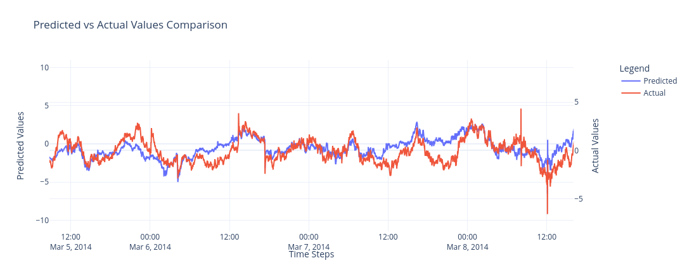

# HackathonTSForecasting
Time series forecasting hackathon 26-27 Apr 2025

## Not presented:
- Leakage check.
    - Calculate train[t:t+i] and train[t:t+i+1]
    - check if last and [-2] values are the same

# IMPORTANT

Prediction is better than it was presented

- True $R^2$ is not 0.2, but 0.72